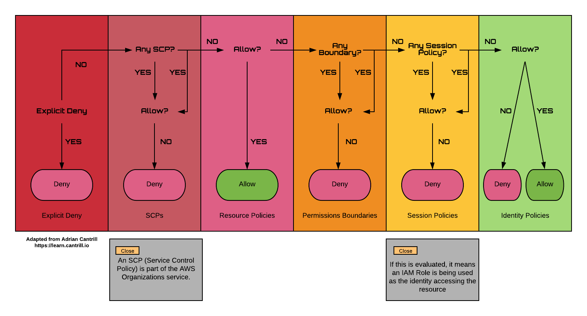

# Policy Evaluation Logic

* [Return to table of contents](../../../README.md)

* **Useful Links:**
  * [Policies Evaluation Logic](https://docs.aws.amazon.com/IAM/latest/UserGuide/reference_policies_evaluation-logic.html)

* **Exam Tips:**
  * Deny -> Allow -> Deny
  * The final effective permissions are the merge of identity, resource, and ACL.
  * Explicit Deny -> SCP -> Resource Policies -> Permissions Boundaries -> Session Policies -> Identity Policies

