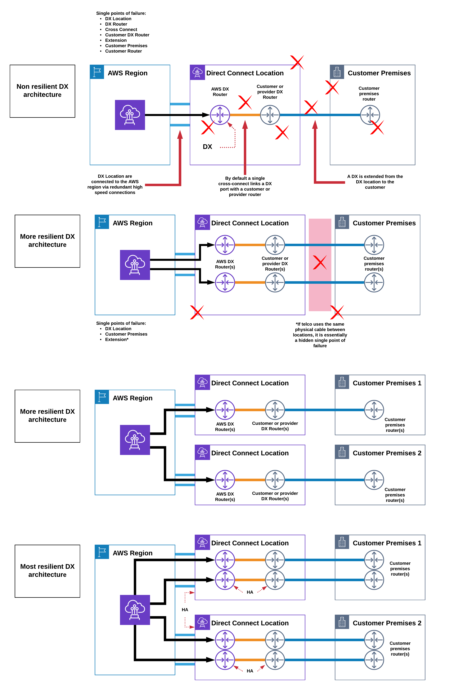

# AWS Direct Connect Architecture

* [Return to table of contents](../../../README.md)

* **Useful Links:**
  * [Direct Connect Getting Started](https://docs.aws.amazon.com/directconnect/latest/UserGuide/getting_started.html)
  * [Multiple Data Center HA Network Connectivity](https://aws.amazon.com/answers/networking/aws-multiple-data-center-ha-network-connectivity)
  * [Direct Connect](https://aws.amazon.com/directconnect/faqs/)
  * [Designing Hybrid Networks in AWS](https://app.pluralsight.com/library/courses/designing-hybrid-networks-aws/table-of-contents)
  * [AWS Direct Connect Gateway – Inter-Region VPC Access](https://aws.amazon.com/blogs/aws/new-aws-direct-connect-gateway-inter-region-vpc-access/)
  
* **Exam Notes:**
  * Terabytes of data? Direct Connect.
  * Remember the set up time required - Weeks to months.
  * Connections over a Direct Connect are _not_ encrypted.
  * Private VIFs are a one-to-one connection.
  * There is a charge per hour for the port.
  * Data transfer out is charged.
  * Routes advertised over BGP.
  * Can create multiple Direct Connects to a single DX location.
  * Important options:
    * Speed: 1Gbps or 10Gbps
    * DX location
  * AWS allocates a DX port in the DX location
    * 1000-Base-LX or 10GBASE-LR
  * Request a cross-connect into your network (Your router).
  * Private VIF connects to a Virtual Private Gateway (VGW).
  * Public VIF, public zone services but not internet.
  * **From AWS:**
    * 1Gbps => 10Gbps
  * **From Partner:**
    * Ranges of speeds: 50Mbps => 10Gbps
    * Hosted connection - a DX connection with _one_ .
    * Hosted VIF - Single VIF with shared bandwidth*
  * **MISC:**
    * Direct connect offers no encryption!
      * Any data transiting unless encrypted by an application is not encrypted.
    * Provision DX, provision public VIF and the create a site-to-site VPN across the VPN.
    * No sharing internet data cap.
    * No sharing internet bandwidth.
    * No transit over the internet - low/consistent latency.
    * Cheaper data transfer / faster speeds.
  * **Link Aggregation Groups (LAGS):**
    * Multiple physical connections act as one - Speed * n
      * Provide less admin overhead, more speed, but not really more resilience.
    * Max of 4 connections per LAG
      * All must be same **speed**
      * Must terminate at same location.
    * Lag active as long as MinimumLinks attribute is healthy.
  * **Transit VIFS:**
    * Public VIF can access all AWS public .
      * VLAN and BGP session.
    * Private VIF can only access VPC's in the same AWS region via VGWs.
  * **DX Gateway:**
    * 

